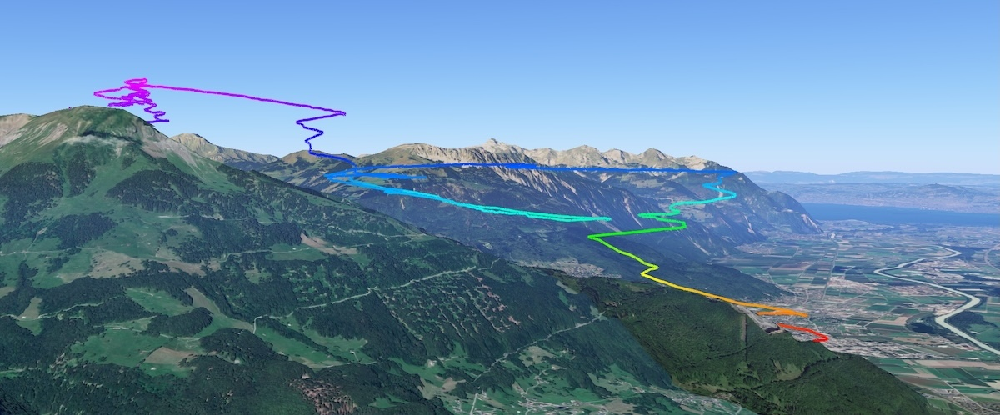

```{r}
#| echo: false
#| warning: false
  
library(here)
library(tidyverse)
library(rmarkdown)

date_vol <- metadata$date
n_vols <- metadata$vols
```

## Infos sur la journée

```{r}
#| echo: false
#| warning: false

d <- readRDS(here("data","data.rds"))

# d$date_vol <- str_extract(d$`Nom de fichier`, "\\d{4}-\\d{2}-\\d{2}")

# d$date_vol <- as.Date(d$date_vol)

# Formatez les dates avec strftime()
# d$date_vol <- strftime(d$date_vol, "%e %B %Y")

# Restaurez la locale précédente
# Sys.setlocale("LC_TIME", old_locale)

# Enlever l'éventuel espace au début
# d$date_vol <- trimws(d$date_vol, which = "left")

d_post <- d |> 
  filter(Date == date_vol) |> 
  select(Date,`Heure de décollage`, `Nomn de décollage`, `Nomn d'atterrissage`, `Durée`)

```

C'était le `r format(as.Date(date_vol), "%d %B %Y")`. Je suis parti de la région de `r d_post[3]` à `r d_post[2]` et j'ai atterri dans la région de `r d_post[4]` pour un durée de vol de `r d_post[5]`. J'ai volé `r rmarkdown::metadata$vols` fois dans la journée.

C'est la première fois que je pars de la maison pour aller directement à Valerette, tout à pieds, pour voler (je crois bien). Au niveau du vol, on a eu des conditions extraordinaires. C'était impossible de descendre et le vent était rassurant. La sensation, vers Valerette, avec les vents ascendants, était fabuleuse.

On est passé au-dessus du décollage. J'ai pris 4.5 m/s d'ascendance. Au final, on est parti atterrir parce qu'on avait décidé de descendre.

Je n'ai pas de souvenir d'un vol pareil.

C'était fantastique.

J'ai pu appeler Laure qui a filmé depuis la maison, puis aller en direction de Chenarlier pour saluer mes parents. J'avais les airpods. J'ai perdu Manu de vue par moments, puis on s'est retrouvés ça et là. Il a même fait les oreilles pour descendre à ma hauteur afin que nous puissions nous parler.

Au final, avec le "mal des transports", j'ai cherché à perdre de l'altitude en allant direction hôpital (ombre et vent descendant du soir) avec les oreilles. J'ai pris du temps à descendre. 

C'était incroyable.

Ce vol avait été organisé par Manu qui m'a rejoint aux Cerniers avec le bus. On a pu remonter à la maison avec sa voiture.

Mémorable.


## Images de la journée

```{r}
#| echo: false
#| warning: false
#| results: asis 

if (dir.exists(here("img", date_vol))) {
  fichiers <- list.files(here("img", date_vol), full.names = FALSE)
  for (i in seq_along(fichiers)) {
    cat("\n","<br/><br/>", sep="")
  }
}

```


## Souvenirs vidéo








## Trace de vol 



## Hike and Fly

```{r}
#| echo: false
#| warning: false

if (metadata$hike == TRUE) {
  walk <- metadata$walk
  hike <- paste0("J'ai pu faire un peu de hike'n fly. J'ai marché environ ", walk, ".")
  pic <- knitr::include_graphics(path= here("img", paste0(date_vol,"_walk",".jpeg")))

} else {
  hike <- "je n'ai pas fait de hike'n fly."
  pic <- ""
  pic2 <- ""
}

```

`r hike`

`r pic`

